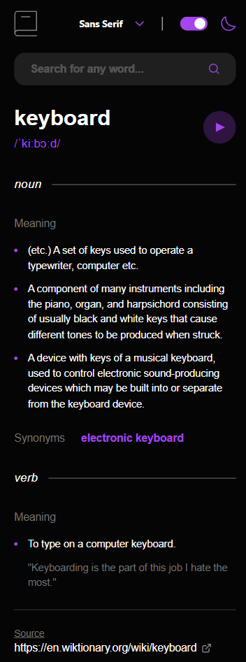

# Frontend Mentor - Dictionary web app solution

Hello again, everyone! 👋 This will be my 7th submission! 🎉

Below is a solution to the [Dictionary web app challenge on Frontend Mentor](https://www.frontendmentor.io/challenges/dictionary-web-app-h5wwnyuKFL). Frontend Mentor challenges help you improve your coding skills by building realistic projects.

## Table of contents

- [Overview](#overview)
  - [The challenge](#the-challenge)
  - [Screenshot](#screenshot)
  - [Links](#links)
- [My process](#my-process)
  - [Built with](#built-with)
  - [What I learned](#what-i-learned)
  - [Useful resources](#useful-resources)
- [Author](#author)

## Overview

### The challenge

Users should be able to:

- Search for words using the input field ✅
- See the Free Dictionary API's response for the searched word ✅
- See a form validation message when trying to submit a blank form ✅
- Play the audio file for a word when it's available ✅
- Switch between serif, sans serif, and monospace fonts ✅
- Switch between light and dark themes ✅
- View the optimal layout for the interface depending on their device's screen size ✅
- See hover and focus states for all interactive elements on the page ✅
- **Bonus**: Have the correct color scheme chosen for them based on their computer preferences. _Hint_: Research `prefers-color-scheme` in CSS. ✅

### Screenshot

 

### Links

- Solution URL: [Frontend Mentor](https://your-solution-url.com)
- Live Site URL: [Vercel](https://dictionary-jhellard.vercel.app/)

## My process

### Built with

- Tailwind CSS
- Flexbox
- CSS Grid
- Mobile-first workflow
- [React](https://reactjs.org/) - JS library
- [Tailwind CSS](https://tailwindcss.com/) - For styles
- [Tanstack/React Query](https://tanstack.com/query/latest) - Handling API Data

### What I learned

I had limited experience using React Query going in, but thanks to [Web Dev Simplified's YouTube tutorial](https://www.youtube.com/watch?v=r8Dg0KVnfMA), I was able to quickly pick it up and start using it in the project, I love how easy it is to handle loading, error, and success states.

I had not used the JS .some method before, using it here to check whether the audio file existed was extremely handy.

TailwindCSS was something I wanted to use more extensively in a project, I have a ton of experience in CSS/SCSS (Mostly thanks to [Kevin Powell](https://www.youtube.com/@KevinPowell)) and found the transition fairly straight-forward. I plan to continue using it in the future as my main struggle with CSS was thinking of all the 'best practice' class names. - I still have a lot to learn with Tailwind but am eager to keep using it.

### Useful resources

- [Tailwind Docs](https://tailwindcss.com/docs) - These docs are so good it is a breeze to find anything you need.
- [Toggle Switch](https://codepen.io/fydsa) - Saba Alikhani makes some amazing components, I took his Toggle switch and converted it mostly over to Tailwind.

## Author

- Website - [Joshua Hellard](https://www.hellard.dev)
- Frontend Mentor - [@jhellard](https://www.frontendmentor.io/profile/jhellard)
